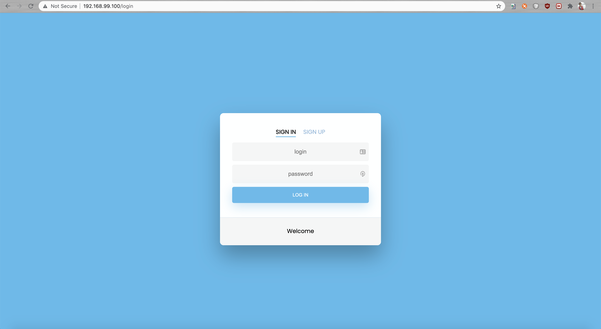
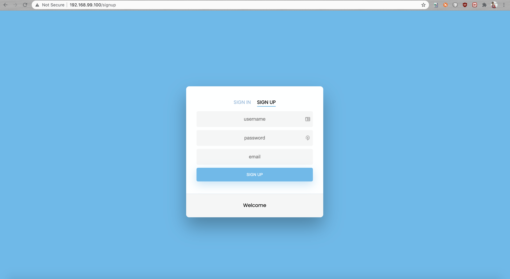
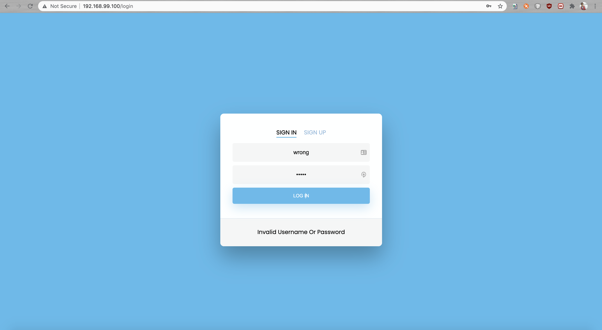
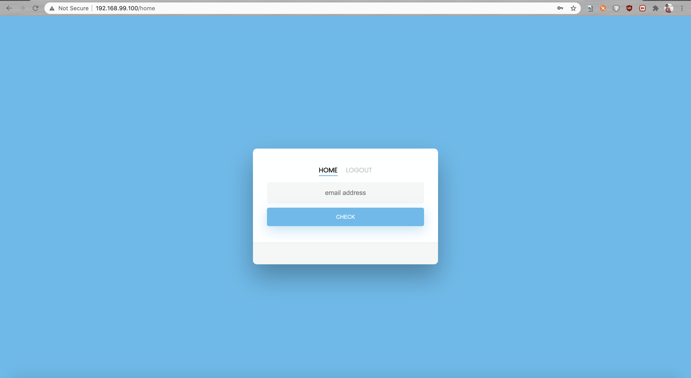
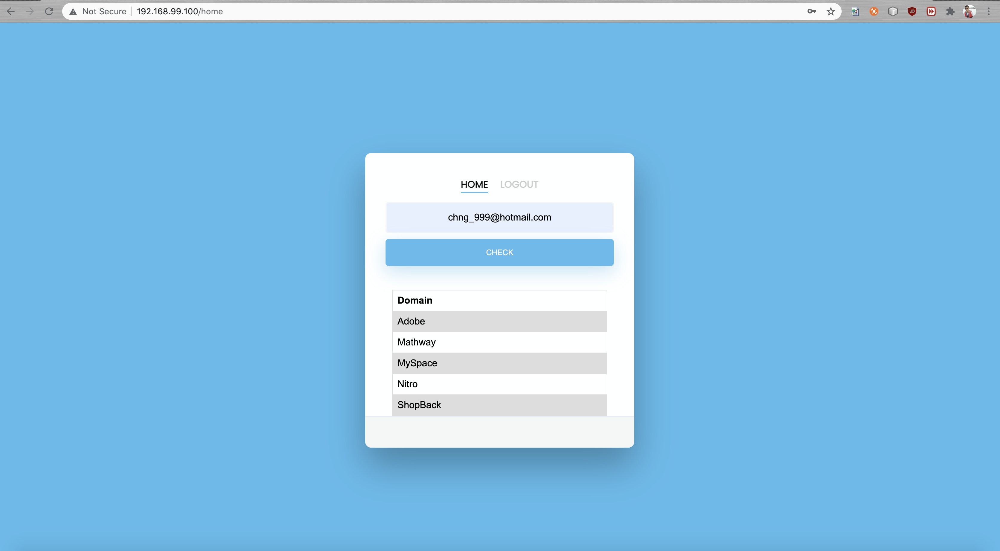
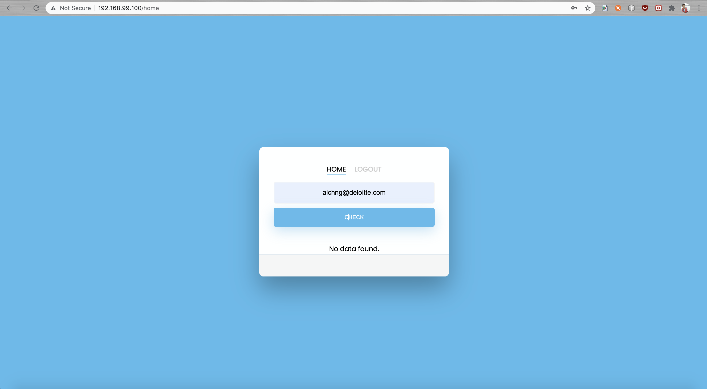

# FullStack Golang Applications
A learning and experience application, Golang Email Compromised is a Application build with following technology :
- [Redis](https://redis.io/)
- [Postgres](https://www.postgresql.org/)
- [Golang](https://golang.org/)
- [Docker](https://www.docker.com/)
- [Nginx](https://www.nginx.com/)
- [JWT Token ](https://jwt.io/)
- HTML/CSS/Jquery


## Installation
- Install Postgres, Redis, Golang, Nginx in your local.
- Install docker-compose together with Docker.
- After setup up all the prerequisite tools, you might need to change .env point to your one.
- If using MacOS, you have to setup your environment for docker.
- Run following commands 
```bash
docker-compose build & docker-compose up
```


## Usage
```bash
redis-server /usr/local/etc/redis.conf
```


## Project Structure
``` Project Strucutre
├── demo_picture          # All the demo picture
├── nginx                 
│   ├── static            # All the static file (CSS)
│   ├── templates         # All the html file (HTML)
│   ├── Dockerfile        # Dockerfile config for nginx
│   ├── mime.types        # all the file type providefor nginx
│   └── nginx.conf        # nginx config
├── script                # All the SQL script
├── .dockerignore         
├── .env                  
├── docker-compose.yml
├── Dockerfile
├── go.mod
├── go.sum
├── login.go              # All the login and credential logic
├── main.go               # main file init DB and cache and all the route path
├── models.go             # struct will be here
├── README.md
└── todo.go               # all the route logic is here
```


# Improvement
- Apply GORM into application. Try to use ORM tools for golang.
- Project Structure and Code Strucutre can be rearrange into more detail parts.
- Security Features.


# Demo Screen







